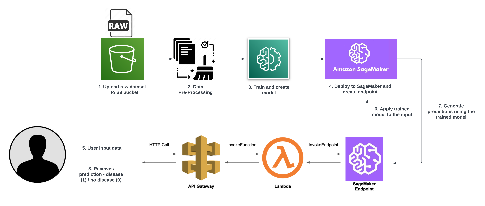

# App

This project contains an AWS Lambda maven application with [AWS Java SDK 2.x](https://github.com/aws/aws-sdk-java-v2) dependencies.

## AWS SageMaker Liver Disease Prediction

Machine learning can be a valuable tool in predicting liver disease and assisting healthcare professionals in making informed decisions. Liver disease can be influenced by various factors such as age, gender, bilirubin levels, liver enzymes, and overall liver function. In this project, we leverage AWS SageMaker to train a predictive model using the AWS Linear Learner algorithm, which is specifically designed for linear regression and classification tasks.

Disclaimer: This application serves as a demonstration and should not be regarded as medical advice. It is important to consult with medical professionals for accurate diagnosis and treatment.

## Description

The project utilizes the ["Indian Liver Patient Records"](https://archive.ics.uci.edu/dataset/225/ilpd+indian+liver+patient+dataset) dataset, which consists of clinical and demographic information of patients diagnosed with liver diseases. This dataset provides valuable insights into various factors contributing to liver diseases, including age, gender, total bilirubin levels, alkaline phosphotase levels, and more. By training a machine learning model using this dataset, the project aims to predict the presence of liver disease based on the provided patient data.

### Architecture
The architecture of the application follows a serverless design, leveraging AWS services for efficient and scalable deployment. It consists of the following components:

1. API Gateway: It serves as the entry point for the application, receiving incoming HTTP POST requests from clients. It provides a RESTful API interface that allows clients to interact with the application.

2. Lambda Function: It acts as the core processing unit of the application. When API Gateway receives a request, it triggers the Lambda function, which executes the business logic of the application. The Lambda function performs data processing, invokes the SageMaker service for making predictions on liver disease, and returns the inference to the API Gateway.

3. SageMaker: It is the machine learning service provided by AWS. A suitable algorithm, such as the AWS Linear Learner was trained using the Indian Liver Patient Records dataset. Once trained, the model was deployed and hosted in SageMaker. The Lambda function interacts with SageMaker to request predictions based on the input data provided.

