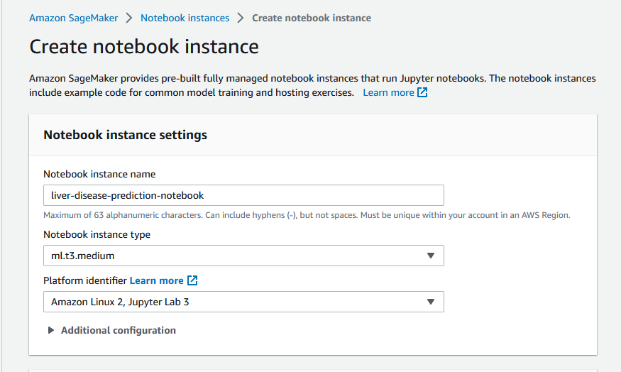
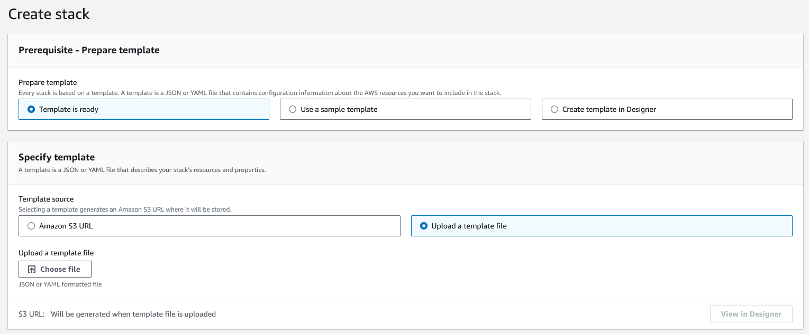
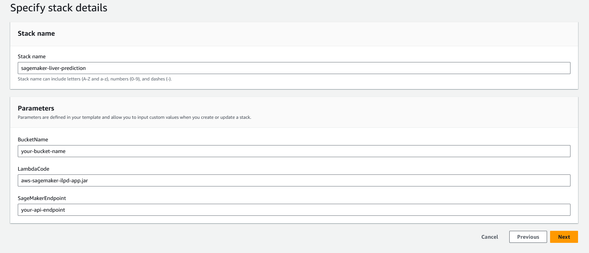
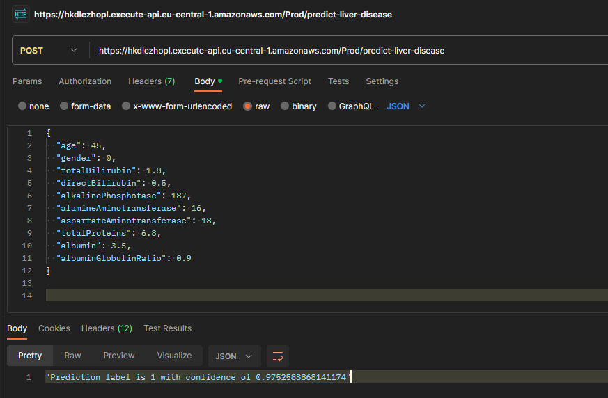
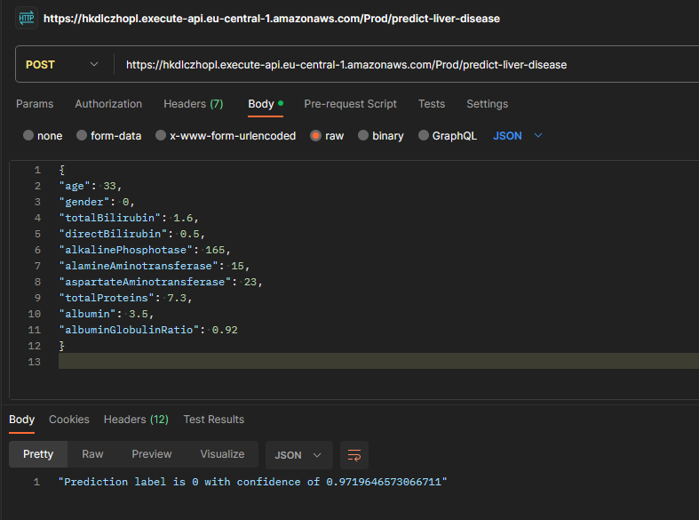

# App

This project contains an AWS Lambda maven application with [AWS Java SDK 2.x](https://github.com/aws/aws-sdk-java-v2) dependencies.

## AWS SageMaker Liver Disease Prediction

Machine learning can be a valuable tool in predicting liver disease and assisting healthcare professionals in making informed decisions. Liver disease can be influenced by various factors such as age, gender, bilirubin levels, liver enzymes, and overall liver function. In this project, we leverage AWS SageMaker to train a predictive model using the AWS Linear Learner algorithm, which is specifically designed for linear regression and classification tasks.

Disclaimer: This application serves as a demonstration and should not be regarded as medical advice. It is important to consult with medical professionals for accurate diagnosis and treatment.

## Description

The project utilizes the ["Indian Liver Patient Records"](https://archive.ics.uci.edu/dataset/225/ilpd+indian+liver+patient+dataset) dataset, which consists of clinical and demographic information of patients diagnosed with liver diseases. This dataset provides valuable insights into various factors contributing to liver diseases, including age, gender, total bilirubin levels, alkaline phosphotase levels, and more. By training a machine learning model using this dataset, the project aims to predict the presence of liver disease based on the provided patient data.

### Architecture
The architecture of the application follows a serverless design, leveraging AWS services for efficient and scalable deployment. It consists of the following components:

1. API Gateway: It serves as the entry point for the application, receiving incoming HTTP POST requests from clients. It provides a RESTful API interface that allows clients to interact with the application.

2. Lambda Function: It acts as the core processing unit of the application. When API Gateway receives a request, it triggers the Lambda function, which executes the business logic of the application. The Lambda function performs data processing, invokes the SageMaker service for making predictions on liver disease, and returns the inference to the API Gateway.

3. SageMaker: It is the machine learning service provided by AWS. A suitable algorithm, such as the AWS Linear Learner was trained using the Indian Liver Patient Records dataset. Once trained, the model was deployed and hosted in SageMaker. The Lambda function interacts with SageMaker to request predictions based on the input data provided.

### Quick start
The goal of the quick start tutorial is to use a cloud formation template to deploy the sample application in your own AWS account.

Before you start:
  1. Login to AWS or create an account
  2. [Create an S3 bucket](https://docs.aws.amazon.com/AmazonS3/latest/userguide/creating-bucket.html)
     a. Note: make sure your bucket name starts with ‘sagemaker’.  This allows SageMaker to access your bucket.
  3. Upload the **'ilpd.csv'** dataset file located in project **/src/main/resources** directory to your S3 Bucket.
  4. Upload the **'aws-sagemaker-ilpd-app.jar'** file to your S3 bucket.
  5. Download the **'liver-disease-prediction.ipynb'** file to your computer.

#### Training the SageMaker Model
  1. From the AWS Console select **'Amazon SageMaker'** and click on **Create notebook instance**

  2. Once your notebook instance is ‘In Service’, open Jupyter and upload **'liver-disease-prediction.ipynb'**
  3. Enter the bucket name you previously created in the first code cell.
  4. Once you've specified your bucket, click **'Run'**.
  5. Keep clicking **'Run'** on each cell block that contains code. A number is shown next to a cell when its execution is complete.
    a. Note: Training and deploying the model may take a few minutes.
  6. Copy the endpoint name once your model has been hosted. This endpoint name will be used when starting cloud formation.
  7. Optional: You can keep running the remaining cell blocks in SageMaker notebook to obtain the model's accuracy.

#### Launch CloudFormation
  1. From the AWS Console, select **'CloudFormation'**.
  2. Go to **'Stacks'** --> **'Create Stack'** (With new resources (standard))
  3. Select **'Template is ready'** and **'Upload a template file'**
  4. Upload the **'template.yaml'** file from the project root directory.

  5. Click **'Next'** to specify stack details 
    a. Choose a stack name 
    b. Specify your bucket name (the bucket you created earlier)
    c. Specify the uploaded lambda code (the packaged .jar file) 
    d. Specify the SageMaker endpoint (the endpoint you copied from your Notebook instance)

  6. On the next pages, leave all other fields to their default values and click **'Next'**.
  7. On the last page, acknowledge all **'Transform might require access capabilities'**.
  8. Click **'Submit'** and once the stack is created, click on **'Output'** tab.
  9. Copy the link from the **'Value'** tab. This is the API Gateway endpoint used for real-time predictions.

#### Predicting liver disease in real time
  To call your API in real time, you can use the API Gateway console or Postman. See the sample data below to get a real-time prediction of liver disease in Postman.

{
  "age": 45,
  "gender": 0,
  "totalBilirubin": 1.8,
  "directBilirubin": 0.5,
  "alkalinePhosphotase": 187,
  "alamineAminotransferase": 16,
  "aspartateAminotransferase": 18,
  "totalProteins": 6.8,
  "albumin": 3.5,
  "albuminGlobulinRatio": 0.9
}

Here's another example that returns **'no disease (0)'**:

{ "age": 33, "gender": 0, "totalBilirubin": 1.6, "directBilirubin": 0.5, "alkalinePhosphotase": 165, "alamineAminotransferase": 15, "aspartateAminotransferase": 23, "totalProteins": 7.3, "albumin": 3.5, "albuminGlobulinRatio": 0.92 }

